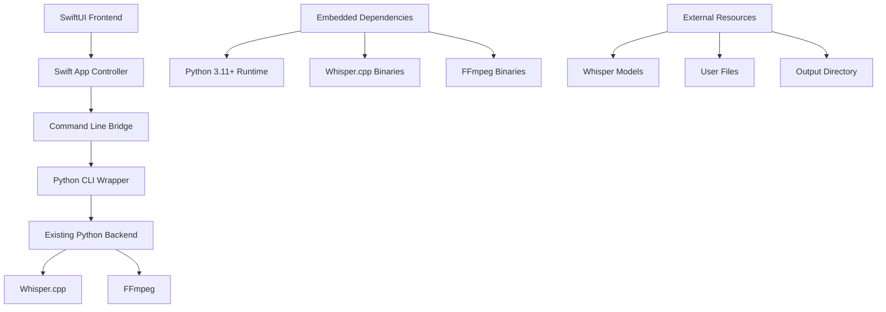

# Design Document

## Overview

WhisperLocalMacOs is a native macOS desktop application that converts the existing web-based Whisper Transcription Tool into a standalone app. The design follows a hybrid architecture with a Swift/SwiftUI frontend communicating with the existing Python backend through a command-line bridge. All dependencies are embedded within the app bundle to ensure zero-configuration deployment.

## Architecture

### High-Level Architecture



### Component Architecture

The application follows a layered architecture with clear separation of concerns:

**Presentation Layer (Swift/SwiftUI)**
- Native macOS UI components
- MVVM pattern implementation
- Real-time progress updates
- File drag-and-drop handling

**Application Layer (Swift)**
- Business logic coordination
- Process management
- Error handling and logging
- State management

**Integration Layer (Command Line Bridge)**
- Swift Process API for Python communication
- JSON-based IPC protocol
- Progress monitoring
- Resource management

**Backend Layer (Python)**
- Minimal CLI wrapper (macos_cli.py)
- Existing transcription logic
- Model management
- File processing

## Components and Interfaces

### 1. Swift Frontend Components

#### MainWindowController
```swift
class MainWindowController: NSWindowController {
    // Window management and toolbar setup
    // Coordinates between sidebar and main content
    // Handles file drag-and-drop events
}
```

#### TranscriptionViewModel
```swift
@MainActor
class TranscriptionViewModel: ObservableObject {
    @Published var transcriptionQueue: [TranscriptionTask]
    @Published var currentProgress: Double
    @Published var isProcessing: Bool
    
    func addFiles(_ urls: [URL])
    func startTranscription()
    func cancelTranscription()
}
```

#### ModelManagerViewModel
```swift
@MainActor
class ModelManagerViewModel: ObservableObject {
    @Published var availableModels: [WhisperModel]
    @Published var selectedModel: WhisperModel?
    @Published var downloadProgress: [String: Double]
    
    func downloadModel(_ model: WhisperModel)
    func selectModel(_ model: WhisperModel)
}
```

### 2. Command Line Bridge

#### PythonBridge
```swift
class PythonBridge {
    private let pythonExecutable: URL
    private let cliWrapper: URL
    
    func transcribeFile(_ fileURL: URL, options: TranscriptionOptions) async throws -> TranscriptionResult
    func extractAudio(_ videoURL: URL) async throws -> URL
    func downloadModel(_ modelName: String) async throws
    func getAvailableModels() async throws -> [WhisperModel]
}
```

#### IPC Protocol (JSON)
```json
{
  "command": "transcribe",
  "input_file": "/path/to/audio.mp3",
  "output_dir": "/path/to/output",
  "model": "tiny",
  "formats": ["txt", "srt", "vtt"],
  "language": "auto"
}
```

Progress Updates:
```json
{
  "type": "progress",
  "progress": 0.45,
  "status": "transcribing",
  "eta_seconds": 120,
  "current_file": "audio.mp3"
}
```

### 3. Python CLI Wrapper

#### macos_cli.py Structure
```python
class MacOSCLIWrapper:
    def __init__(self):
        self.setup_logging()
        self.load_config()
    
    def transcribe_file(self, args: dict) -> dict:
        # Wrapper around existing transcription logic
        # Provides JSON output for Swift consumption
        
    def extract_audio(self, args: dict) -> dict:
        # Video-to-audio extraction wrapper
        
    def download_model(self, args: dict) -> dict:
        # Model download with progress reporting
        
    def get_models(self) -> dict:
        # List available and downloaded models
```

### 4. Embedded Dependencies Structure

```
WhisperLocalMacOs.app/
├── Contents/
│   ├── MacOS/
│   │   └── WhisperLocalMacOs
│   ├── Resources/
│   │   ├── python/                 # Embedded Python runtime
│   │   │   ├── bin/python3
│   │   │   └── lib/python3.11/
│   │   ├── whisper-cpp/           # Whisper.cpp binaries
│   │   │   └── whisper-cli
│   │   ├── ffmpeg/                # FFmpeg binaries
│   │   │   └── ffmpeg
│   │   └── src/                   # Python source code
│   │       └── whisper_transcription_tool/
│   └── Info.plist
```

## Data Models

### Core Data Structures

#### TranscriptionTask
```swift
struct TranscriptionTask: Identifiable {
    let id = UUID()
    let inputURL: URL
    let outputDirectory: URL
    let model: WhisperModel
    let formats: [OutputFormat]
    var status: TaskStatus
    var progress: Double
    var error: Error?
}

enum TaskStatus {
    case pending
    case processing
    case completed
    case failed
}
```

#### WhisperModel
```swift
struct WhisperModel: Identifiable, Codable {
    let id: String
    let name: String
    let size: Int64
    let description: String
    let isDownloaded: Bool
    let performance: ModelPerformance
}

struct ModelPerformance {
    let speedMultiplier: Double  // e.g., 2.5x real-time
    let accuracy: String         // "Good", "Better", "Best"
    let memoryUsage: String      // "Low", "Medium", "High"
}
```

#### TranscriptionResult
```swift
struct TranscriptionResult: Codable {
    let inputFile: String
    let outputFiles: [String]
    let processingTime: TimeInterval
    let modelUsed: String
    let language: String?
    let success: Bool
    let error: String?
}
```

## Error Handling

### Error Categories and Responses

#### File Processing Errors
- **Invalid file format**: Display supported formats and suggest conversion
- **File not found**: Verify file exists and is accessible
- **Insufficient disk space**: Calculate required space and suggest cleanup
- **Permission denied**: Request file access permissions

#### Model Management Errors
- **Model download failed**: Retry mechanism with exponential backoff
- **Model corruption**: Automatic re-download with verification
- **Model not found**: Fallback to default model with user notification

#### System Resource Errors
- **Memory exhaustion**: Pause processing and suggest closing other apps
- **CPU overload**: Implement processing throttling
- **Dependency missing**: Verify embedded dependencies and suggest reinstall

### Error Recovery Strategies

```swift
enum AppError: LocalizedError {
    case fileProcessingFailed(String)
    case modelNotAvailable(String)
    case systemResourceExhausted
    case dependencyMissing(String)
    
    var errorDescription: String? {
        switch self {
        case .fileProcessingFailed(let file):
            return "Failed to process \(file). Please check the file format and try again."
        case .modelNotAvailable(let model):
            return "Model '\(model)' is not available. Would you like to download it now?"
        case .systemResourceExhausted:
            return "System resources are low. Please close other applications and try again."
        case .dependencyMissing(let dependency):
            return "Required component '\(dependency)' is missing. Please reinstall the application."
        }
    }
    
    var recoverySuggestion: String? {
        switch self {
        case .fileProcessingFailed:
            return "Supported formats: MP3, WAV, M4A, FLAC, MP4, MOV, AVI"
        case .modelNotAvailable:
            return "Download models from the Model Manager"
        case .systemResourceExhausted:
            return "Free up memory or use a smaller model"
        case .dependencyMissing:
            return "Download the latest version from GitHub"
        }
    }
}
```

## Testing Strategy

### Unit Testing (Swift)
- **ViewModels**: Test state management and business logic
- **PythonBridge**: Mock Python process communication
- **Data Models**: Validate serialization and validation logic
- **Error Handling**: Test all error scenarios and recovery paths

### Integration Testing
- **Swift-Python Bridge**: Test complete communication flow
- **File Processing**: Test with various file formats and sizes
- **Model Management**: Test download, verification, and selection
- **Batch Processing**: Test queue management and concurrent operations

### UI Testing (XCTest)
- **File Drag-and-Drop**: Automated UI tests for file handling
- **Progress Updates**: Verify real-time progress display
- **Model Manager**: Test model download and selection UI
- **Error Dialogs**: Test error presentation and user actions

### Performance Testing
- **Startup Time**: Measure app launch performance (target: <5 seconds)
- **Transcription Speed**: Benchmark against web version performance
- **Memory Usage**: Monitor memory consumption during batch processing
- **Resource Management**: Test behavior under resource constraints

## Security Considerations

### Code Signing and Distribution
- **Ad-hoc Signing**: Enable distribution without Apple Developer Program
- **Gatekeeper Compatibility**: Ensure app launches without security warnings
- **Bundle Verification**: Implement integrity checks for embedded dependencies

### File System Access
- **Sandboxing Considerations**: Design for potential future App Store distribution
- **User Data Protection**: Respect user privacy for processed files
- **Temporary File Cleanup**: Secure deletion of temporary processing files

### Network Security
- **Model Downloads**: Verify checksums for downloaded models
- **HTTPS Only**: Use secure connections for all network requests
- **Certificate Pinning**: Implement for critical download endpoints

## Performance Optimization

### Apple Silicon Optimization
- **Metal Performance Shaders**: Leverage GPU acceleration where possible
- **Native ARM64 Compilation**: Ensure all binaries are Apple Silicon native
- **Memory Management**: Optimize for unified memory architecture
- **Thermal Management**: Monitor and respond to thermal throttling

### Resource Management
- **Lazy Loading**: Load models and dependencies on demand
- **Memory Pooling**: Reuse buffers for audio processing
- **Background Processing**: Use background queues for non-UI operations
- **Progress Batching**: Limit UI update frequency to maintain responsiveness

### Caching Strategy
- **Model Caching**: Keep frequently used models in memory
- **Result Caching**: Cache transcription results for duplicate files
- **Metadata Caching**: Store file metadata to avoid repeated analysis
- **Configuration Caching**: Persist user preferences and settings